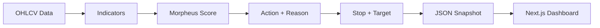
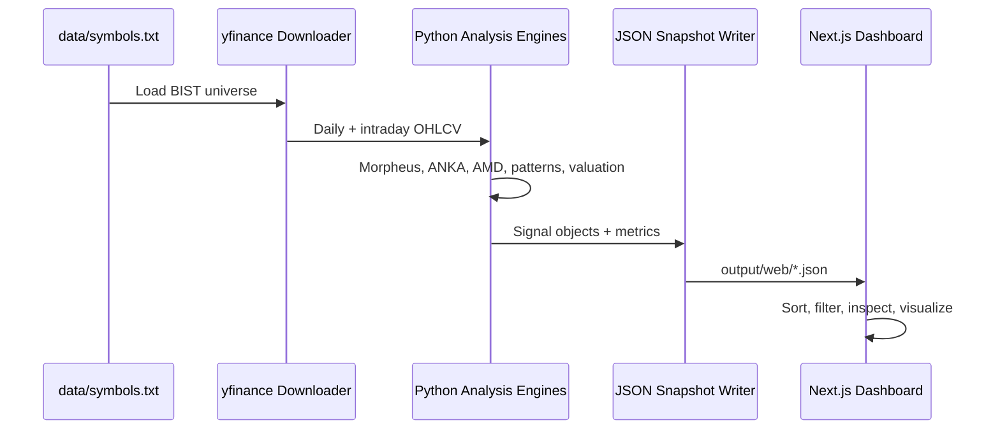

<div align="center">

# BIST Analyzer

### A full-stack market intelligence cockpit for Borsa Istanbul

**Morpheus scoring · Technical analysis · Fair value · Smart money scans · Intraday AMD · Pattern engines · Modern dashboard**


</div>

---

## What Is This?

**BIST Analyzer** is a Python + Next.js research platform for scanning, scoring, and visualizing Borsa Istanbul stocks.

It downloads daily and intraday OHLCV data, computes multiple analysis engines, writes clean JSON snapshots, and renders everything in a fast, sortable dashboard.

The current technical ranking engine is powered by a **Morpheus-style additive score** that can exceed 100 and is built around:

- Trend perfection through EMA alignment
- Historical win-rate confidence
- ADX trend strength
- Volume explosion and money flow
- Price position
- Bollinger squeeze and breakout potential
- Stop and target levels for every stock

> This project is an analysis and research tool. It is not investment advice.

---

## Dashboard Preview

```text
┌─────────────────────────────────────────────────────────────────────────────┐
│ BIST Analyzer                                                               │
│                                                                             │
│  Hisse  Fiyat  Skor  Aksiyon  Neden  WR%  ADX  V/K  DZL  SQZ  Stop  Hedef │
│  ─────  ─────  ────  ───────  ─────  ───  ───  ───  ───  ───  ────  ───── │
│  INVES  538.0  261   GÜÇLÜ AL  ...   100  54   1.3   OK   OK   ...   ...  │
│  MANAS   24.9  256   AL        ...    46  16   3.3   OK   OK   ...   ...  │
│  KRDMB   84.7  265   KAR AL    ...    89  63   2.0   OK   --   ...   ...  │
└─────────────────────────────────────────────────────────────────────────────┘
```

---

## Feature Matrix

| Area | Engine | What It Does |
|---|---|---|
| Technical Scoring | Morpheus | Additive score with EMA perfect order, WR%, ADX, V/K, DZL, SQZ |
| Risk Levels | Stop / Target | Produces stop and target levels for every stock, including BEKLE and KAR AL |
| Trend & Momentum | Indicators | EMA, SMA, RSI, MACD, ADX, Bollinger, ATR, OBV |
| Smart Money | Silent Accumulation | RSI divergence, OBV/CMF accumulation, relative strength, base detection |
| Intraday Structure | AMD Model | Accumulation, manipulation, CISD, distribution projections |
| Adaptive Channel | ANKA v2 | Seven Valley phase model, adaptive wings, kNN volume, calibration |
| Meta Engine | ANKA Engine | Layer engine, LR trend intensity, kNN pattern, weighted synthesis |
| Pattern Quality | Cup & Handle | Cup symmetry, handle depth, breakout quality, measured target |
| Fair Value | Valuation Engine | 10-method sector-weighted fair value model |
| Fundamental Quality | Buffett | Quality, moat, valuation, shareholder and data-quality scoring |

---

## Morpheus Scoring Model

The main technical score is no longer a normalized 0-100 score. It is an additive ranking model designed to surface the strongest candidates first.

| Component | Signal | Effect |
|---|---|---|
| Perfect Order | `close > EMA20 > EMA50 > EMA200` | Adds the explicit DZL bonus |
| WR% | Last 110 bars of similar historical setups | Adds confidence when prior setups worked |
| V/K | Latest volume divided by 20-day volume average | Rewards real participation |
| ADX | Trend strength above 25 | Rewards powerful directional moves |
| Squeeze | Bollinger compression / breakout | Rewards spring-loaded setups |
| EMA Distance | Distance from EMA13 | Rewards healthy momentum, warns on overextension |



---

## Core Dashboard Routes

| Route | Purpose |
|---|---|
| `/` | Main Morpheus technical ranking table |
| `/hisse/[symbol]` | Stock detail page with charts, score breakdown, risk levels |
| `/amd-model` | Intraday AMD candidate table |
| `/amd-model/[symbol]` | Intraday AMD chart with accumulation/manipulation/distribution zones |
| `/anka-v2` | ANKA v2 list with valley, volume and calibration |
| `/anka-v2/[symbol]` | ANKA v2 adaptive channel detail |
| `/anka-engine` | Layered ANKA synthesis engine |
| `/anka-engine/[symbol]` | ANKA engine detail |
| `/cup-handle-quality` | Cup and Handle pattern quality scanner |
| `/cup-handle-quality/[symbol]` | Cup and Handle structure detail |
| `/fair-value` | 10-method fair value list |
| `/fair-value/[symbol]` | Fair value detail |
| `/silent-accumulation` | Smart money / silent accumulation scanner |
| `/buffett` | Fundamental quality and Buffett-style scoring |
| `/buffett/[symbol]` | Fundamental detail |

---

## Architecture

```text
bist_analyzer/
├── analysis/
│   ├── indicators.py              # EMA, RSI, MACD, ADX, BB, ATR, OBV, V/K
│   ├── scoring.py                 # Morpheus additive score engine
│   ├── signals.py                 # Action, reason, stop and target orchestration
│   ├── amd_model.py               # Intraday AMD / Power of 3 model
│   ├── anka_v2.py                 # Adaptive ANKA channel and synthesis
│   ├── cup_handle.py              # Cup and Handle quality engine
│   ├── fair_value.py              # 10-method fair value model
│   └── silent_accumulation.py     # Smart money accumulation scanner
├── data/
│   ├── downloader.py              # yfinance data pipeline
│   ├── tradingview.py             # best-effort TradingView snapshot check
│   └── symbols.txt                # BIST symbol universe
├── reports/
│   ├── web_snapshot.py            # dashboard JSON snapshots
│   ├── terminal_report.py         # Rich terminal table
│   ├── html_report.py             # interactive HTML report
│   └── chart_report.py            # PNG table/chart output
├── dashboard/
│   └── src/
│       ├── app/                   # Next.js routes
│       ├── components/            # dashboard UI components
│       └── lib/                   # loaders, types, helpers
├── tests/
│   ├── test_indicators.py
│   ├── test_scoring.py
│   └── test_buffett_score.py
├── main.py                        # main technical analysis pipeline
├── buffett_main.py                # fundamental analysis pipeline
└── silent_accumulation_main.py    # smart money scanner
```

---

## Data Flow



---

## Installation

### Requirements

- Python 3.10+
- Node.js 18+
- Git
- Windows, macOS or Linux

### Python

```bash
pip install -r requirements.txt
```

### Dashboard

```bash
cd dashboard
npm install
```

---

## Running The Platform

### 1. Generate the main technical snapshot

```bash
python main.py --quiet --no-html --no-charts
```

### 2. Run a small symbol check

```bash
python main.py --symbols THYAO ASELS SASA --quiet --no-html --no-charts
```

### 3. Force-refresh cached market data

```bash
python main.py --force-download --no-html --no-charts
```

### 4. Start the dashboard

```bash
cd dashboard
npm run dev
```

Open:

```text
http://localhost:3000
```

---

## Additional Pipelines

### Buffett / Fundamental Analysis

```bash
python buffett_main.py --quiet
```

### Silent Accumulation Scanner

```bash
python silent_accumulation_main.py
python silent_accumulation_main.py --group 3
python silent_accumulation_main.py --symbols THYAO ASELS SASA
```

---

## Output Files

```text
output/web/latest_report.json                  # main technical + Morpheus snapshot
output/web/stocks/{SYMBOL}.json                # stock detail snapshot
output/web/buffett/latest.json                 # fundamental / Buffett list
output/web/buffett/stocks/{SYMBOL}.json        # fundamental detail
output/web/silent_accumulation/latest.json     # smart money scanner
```

The dashboard reads these generated snapshots directly. The UI does not run market analysis by itself.

---

## Verification

### Python tests

```bash
python -m pytest
```

### Python compile check

```bash
python -m compileall analysis data reports main.py
```

### Dashboard lint

```bash
cd dashboard
npm run lint
```

### TypeScript check

```bash
cd dashboard
npx tsc --noEmit
```

---

## Current Snapshot Health

Latest full technical snapshot:

```text
total symbols in report: 499
missing stop/target: 0
```

Every stock with a valid price now receives stop and target levels. If ATR is missing, the system falls back to swing range or a price-percent volatility estimate.

---

## Engine Notes

### Morpheus Technical Engine

The main ranking table is driven by:

- `analysis/indicators.py`
- `analysis/scoring.py`
- `analysis/signals.py`
- `reports/web_snapshot.py`
- `dashboard/src/components/stocks/stock-table.tsx`

The score output includes:

- `score`
- `action`
- `reason`
- `wr_pct`
- `adx`
- `v_kat`
- `dzl_ok`
- `sqz_ok`
- `stop_loss`
- `target`

### AMD Model

The AMD model reads intraday data and maps:

- Accumulation
- Manipulation sweep
- CISD
- Distribution
- Equal highs / equal lows
- Key opens
- Projection levels

### ANKA v2

ANKA v2 adds:

- Adaptive body / breath / wings
- Seven Valley phase state
- kNN volume interpretation
- Fibonacci confirmation
- Historical calibration

### Fair Value

The fair value engine combines:

1. Net Earnings P/E
2. ROE-Based
3. EV/EBIT
4. EV/EBITDA
5. EV/Revenue
6. Forward P/E
7. Forward P/S
8. P/FCF
9. Graham Number
10. DCF

---

## Important Warnings

- This project is **not** financial advice.
- Trading financial markets involves risk.
- yfinance and public snapshot endpoints can have missing, delayed or inconsistent data.
- TradingView scanner usage is best-effort and should not be treated as an official historical data API.
- Always validate signals with your own research and risk management.

---

<div align="center">

### Built for fast market scanning, explainable scoring and visual decision support.

**Research first. Risk always.**

</div>
